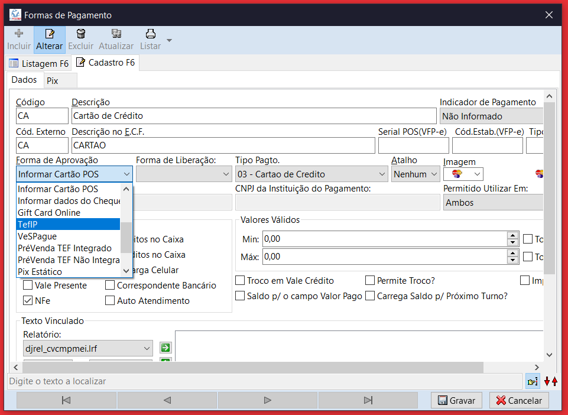
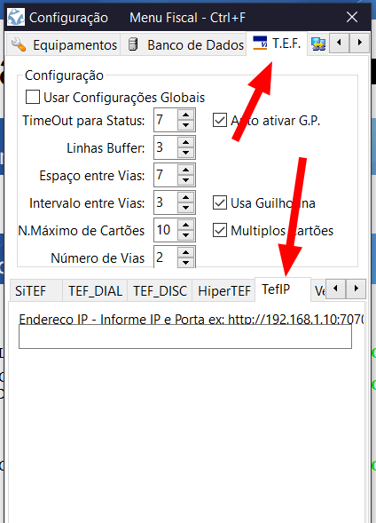

# Integração com DJMonitor

## Configurações necessárias no DJMonitor

1. **Liberação de módulo**: Solicite ao setor financeiro a liberação do módulo TEF IP para o cliente em questão;
2. **Forma de aprovação**: Altere a forma de aprovação para TEF IP nas formas de pagamentos que serão utilizadas juntamente com o TEF IP conforme print abaixo:

!!! warning "Atenção!"
    Para a forma de pagamento PIX, é necessário estar configurado como “tipo pagto: 17 - dinâmico” e com o campo “CNPJ da instituição do pagamento” preenchido

{ style="width: 420px; display: block; margin: 0 auto;"}

## Configurações necessárias no DJPDV

**Endereço IP:** A única configuração necessária no PDV é apontar o IP do TEF IP, essa configuração está disponível na aba T.E.F do PDV, conforme print abaixo:
{ style="width: 420px; display: block; margin: 0 auto;"}
