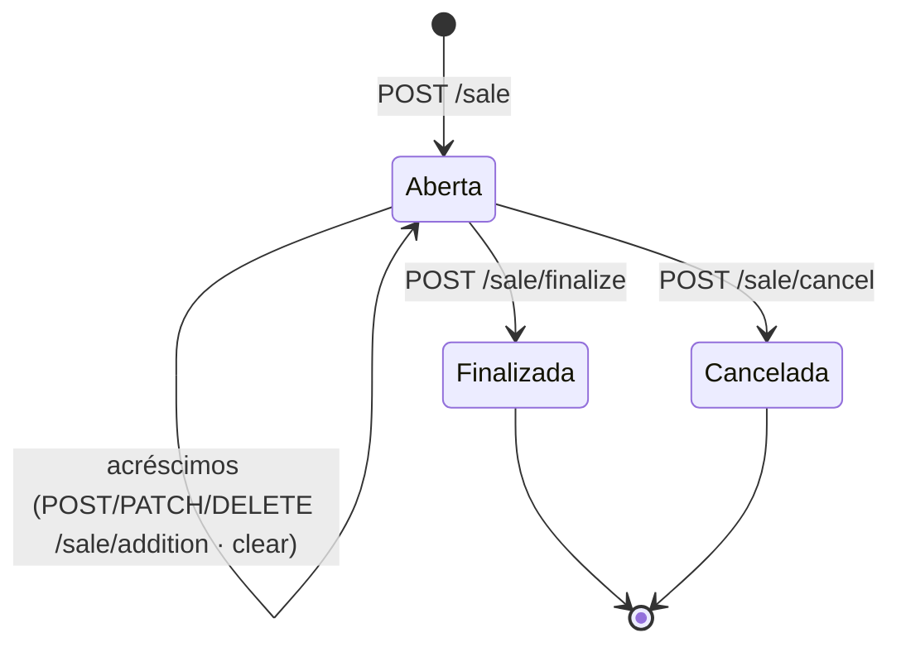

# Venda

Endpoints para gerenciar vendas: abrir um carrinho, adicionar itens e pagamentos, e finalizar ou cancelar a venda. A venda organiza o que foi vendido — o pagamento financeiro é feito separadamente via `POST /transaction`.

!!! warning "Autenticação"
    Todas as requisições exigem Basic Auth. Use as credenciais configuradas no TEF IP (`admin` / senha definida na instalação).

!!! info "Fluxo de venda"
    Uma venda segue a sequência: **iniciar** → **adicionar itens** → **adicionar pagamentos** → **finalizar** (ou **cancelar**). Apenas uma venda pode estar ativa por vez.

---

## Ciclo de Vida da Venda

Diferente de uma transação avulsa, uma **Venda** no TEF IP é uma sessão que acumula itens e pagamentos antes de ser consolidada. O servidor gerencia o estado dessa venda internamente.

### Fluxo de Estados



### Regras Importantes

1.  **Exclusividade**: Apenas uma venda pode estar ativa por vez no dispositivo. Tentar iniciar uma nova sem encerrar a anterior resulta em erro `409 Conflict`.
2.  **Sincronização**: Operações de venda são síncronas. O servidor retorna a confirmação assim que o estado interno é atualizado.
3.  **Documento Fiscal**: Os itens e pagamentos adicionados servem de base para a montagem de cupons fiscais e DANFE.
4.  **Pagamento financeiro**: A venda registra **o quê** foi vendido e **como** foi pago — mas **não processa o débito financeiro**. O pagamento no cartão ou PIX é feito separadamente via [`POST /transaction`](transaction.md). Finalize a venda após confirmar a aprovação da transação.
5.  **Limpeza**: Ao finalizar ou cancelar, o TEF IP limpa automaticamente qualquer conteúdo que esteja sendo exibido no visor do terminal (pop de displays).

---

## Forma das respostas

As rotas de venda seguem uma convenção consistente:

- **`POST`/`PATCH` de uma entidade** (item, pagamento, desconto, acréscimo) retornam **a própria entidade** criada/atualizada.
- **`DELETE`/`clear`/`cancel` e as rotas de cabeçalho** (`GET`/`POST`/`PATCH /sale`) retornam o **cupom completo** (`SaleCoupon`) — o estado atual da venda.
- **`POST /sale/finalize`** e **`POST /sale/cancel`** retornam apenas `{ "message": "..." }`.

O **cupom completo** (`SaleCoupon`) tem o seguinte formato:

```json
{
  "sale": {
    "customerDocument": "123.456.789-00",
    "customerName": "João Silva",
    "sellerName": "Maria",
    "additionalInfo": "Balcão 3",
    "total": null
  },
  "items": [],
  "payments": [],
  "discounts": [],
  "additions": [],
  "summary": {
    "subtotal": 0,
    "surcharge": 0,
    "discount": 0,
    "itemDiscount": 0,
    "itemAddition": 0,
    "total": 0
  }
}
```

!!! note "Valores monetários em reais"
    Todos os valores (`unitPrice`, `total`, `value`, `discount`, `addition`, etc.) trafegam em **reais decimais** (ex.: `10.50`), **não** em centavos. Descontos e acréscimos são armazenados em **módulo** (valor absoluto): enviar `-5.00` é equivalente a `5.00`.

---

## GET /sale

Retorna o estado da venda ativa (o cupom completo). Útil para sincronizar o carrinho a qualquer momento.

**Resposta — 200**

Retorna o **cupom completo** (`SaleCoupon`, ver [Forma das respostas](#forma-das-respostas)).

### Exemplos de integração

=== "cURL"

    ```bash
    curl -u admin:1234 \
         http://localhost:9050/sale
    ```

=== "Dart"

    ```dart
    // pub.dev/packages/dart_tefip — configure uma vez; demais exemplos nesta página omitem esta etapa
    TefIP.baseUrl = 'http://localhost:9050';
    TefIP.username = 'admin';
    TefIP.password = '1234';
    final coupon = await TefIP.instance.sale.get();
    print('Total: ${coupon.summary.total}');
    ```

=== "JavaScript"

    ```js
    // TODO: pacote JavaScript ainda não criado — usando fetch diretamente
    const res = await fetch('http://localhost:9050/sale', {
      headers: { 'Authorization': 'Basic ' + btoa('admin:1234') },
    });
    const data = await res.json();
    ```

=== "PHP"

    ```php
    <?php
    // TODO: pacote PHP ainda não criado — usando curl diretamente
    $ch = curl_init('http://localhost:9050/sale');
    curl_setopt($ch, CURLOPT_USERPWD, 'admin:1234');
    curl_setopt($ch, CURLOPT_RETURNTRANSFER, true);
    $response = json_decode(curl_exec($ch), true);
    curl_close($ch);
    ```

=== "Ruby"

    ```ruby
    # TODO: pacote Ruby ainda não criado — usando Net::HTTP diretamente
    require 'net/http'
    require 'json'

    uri = URI('http://localhost:9050/sale')
    req = Net::HTTP::Get.new(uri)
    req.basic_auth('admin', '1234')
    res = Net::HTTP.start(uri.hostname, uri.port) { |h| h.request(req) }
    data = JSON.parse(res.body)
    ```

---

## POST /sale

Inicia uma nova venda. Retorna `409` se já existir uma venda ativa.

**Corpo da requisição**

```json
{
  "customerDocument": "123.456.789-00",
  "customerName": "João Silva",
  "sellerName": "Maria",
  "additionalInfo": "Balcão 3"
}
```

| Campo | Tipo | Obrigatório | Descrição |
|-------|------|:-----------:|-----------|
| `customerDocument` | string | Não | CPF ou CNPJ do cliente |
| `customerName` | string | Não | Nome do cliente exibido no terminal |
| `sellerName` | string | Não | Nome do vendedor exibido no terminal |
| `additionalInfo` | string | Não | Informação adicional exibida no terminal |
| `total` | number | Não | Valor total a exibir na tela de venda |

**Resposta — 200**

Retorna o **cupom completo** (`SaleCoupon`, ver [Forma das respostas](#forma-das-respostas)).

**Resposta — 409** (já existe uma venda ativa)

```json
{ "code": 409, "message": "Já existe uma venda ativa!" }
```

### Exemplos de integração

=== "cURL"

    ```bash
    curl -u admin:1234 \
         -H "Content-Type: application/json" \
         -X POST http://localhost:9050/sale \
         -d '{"customerName":"João Silva","sellerName":"Maria"}'
    ```

=== "Dart"

    ```dart
    final coupon = await TefIP.instance.sale.post(
      request: SaleStartRequestModel(
        customerName: 'João Silva',
        sellerName: 'Maria',
      ),
    );
    print('Itens: ${coupon.items.length}');
    ```

=== "JavaScript"

    ```js
    // TODO: pacote JavaScript ainda não criado — usando fetch diretamente
    const res = await fetch('http://localhost:9050/sale', {
      method: 'POST',
      headers: {
        'Authorization': 'Basic ' + btoa('admin:1234'),
        'Content-Type': 'application/json',
      },
      body: JSON.stringify({ customerName: 'João Silva', sellerName: 'Maria' }),
    });
    const data = await res.json();
    ```

=== "PHP"

    ```php
    <?php
    // TODO: pacote PHP ainda não criado — usando curl diretamente
    $ch = curl_init('http://localhost:9050/sale');
    curl_setopt($ch, CURLOPT_USERPWD, 'admin:1234');
    curl_setopt($ch, CURLOPT_HTTPHEADER, ['Content-Type: application/json']);
    curl_setopt($ch, CURLOPT_POST, true);
    curl_setopt($ch, CURLOPT_POSTFIELDS, json_encode([
        'customerName' => 'João Silva',
        'sellerName'   => 'Maria',
    ]));
    curl_setopt($ch, CURLOPT_RETURNTRANSFER, true);
    $response = json_decode(curl_exec($ch), true);
    curl_close($ch);
    ```

=== "Ruby"

    ```ruby
    # TODO: pacote Ruby ainda não criado — usando Net::HTTP diretamente
    require 'net/http'
    require 'json'

    uri = URI('http://localhost:9050/sale')
    req = Net::HTTP::Post.new(uri, 'Content-Type' => 'application/json')
    req.basic_auth('admin', '1234')
    req.body = { customerName: 'João Silva', sellerName: 'Maria' }.to_json
    res = Net::HTTP.start(uri.hostname, uri.port) { |h| h.request(req) }
    data = JSON.parse(res.body)
    ```

---

## PATCH /sale

Atualiza os dados da venda ativa (cliente, vendedor, informações adicionais). Usa o mesmo corpo que `POST /sale`.

**Resposta — 200**

Retorna o **cupom completo** (`SaleCoupon`, ver [Forma das respostas](#forma-das-respostas)).

### Exemplos de integração

=== "cURL"

    ```bash
    curl -u admin:1234 \
         -H "Content-Type: application/json" \
         -X PATCH http://localhost:9050/sale \
         -d '{"customerName":"Maria Souza"}'
    ```

=== "Dart"

    ```dart
    await TefIP.instance.sale.patch(
      request: SaleStartRequestModel(customerName: 'Maria Souza'),
    );
    ```

=== "JavaScript"

    ```js
    // TODO: pacote JavaScript ainda não criado — usando fetch diretamente
    const res = await fetch('http://localhost:9050/sale', {
      method: 'PATCH',
      headers: {
        'Authorization': 'Basic ' + btoa('admin:1234'),
        'Content-Type': 'application/json',
      },
      body: JSON.stringify({ customerName: 'Maria Souza' }),
    });
    const data = await res.json();
    ```

=== "PHP"

    ```php
    <?php
    // TODO: pacote PHP ainda não criado — usando curl diretamente
    $ch = curl_init('http://localhost:9050/sale');
    curl_setopt($ch, CURLOPT_USERPWD, 'admin:1234');
    curl_setopt($ch, CURLOPT_HTTPHEADER, ['Content-Type: application/json']);
    curl_setopt($ch, CURLOPT_CUSTOMREQUEST, 'PATCH');
    curl_setopt($ch, CURLOPT_POSTFIELDS, json_encode(['customerName' => 'Maria Souza']));
    curl_setopt($ch, CURLOPT_RETURNTRANSFER, true);
    $response = json_decode(curl_exec($ch), true);
    curl_close($ch);
    ```

=== "Ruby"

    ```ruby
    # TODO: pacote Ruby ainda não criado — usando Net::HTTP diretamente
    require 'net/http'
    require 'json'

    uri = URI('http://localhost:9050/sale')
    req = Net::HTTP::Patch.new(uri, 'Content-Type' => 'application/json')
    req.basic_auth('admin', '1234')
    req.body = { customerName: 'Maria Souza' }.to_json
    res = Net::HTTP.start(uri.hostname, uri.port) { |h| h.request(req) }
    data = JSON.parse(res.body)
    ```

---

## DELETE /sale/clear

Esvazia a venda ativa por completo — remove todos os itens, pagamentos, descontos e acréscimos, preservando o cabeçalho (cliente/vendedor).

**Resposta — 200**

Retorna o **cupom completo** (`SaleCoupon`) já esvaziado (ver [Forma das respostas](#forma-das-respostas)).

### Exemplos de integração

=== "cURL"

    ```bash
    curl -u admin:1234 \
         -X DELETE http://localhost:9050/sale/clear
    ```

=== "Dart"

    ```dart
    await TefIP.instance.sale.clear();
    ```

=== "JavaScript"

    ```js
    // TODO: pacote JavaScript ainda não criado — usando fetch diretamente
    const res = await fetch('http://localhost:9050/sale/clear', {
      method: 'DELETE',
      headers: { 'Authorization': 'Basic ' + btoa('admin:1234') },
    });
    const data = await res.json();
    ```

=== "PHP"

    ```php
    <?php
    // TODO: pacote PHP ainda não criado — usando curl diretamente
    $ch = curl_init('http://localhost:9050/sale/clear');
    curl_setopt($ch, CURLOPT_USERPWD, 'admin:1234');
    curl_setopt($ch, CURLOPT_CUSTOMREQUEST, 'DELETE');
    curl_setopt($ch, CURLOPT_RETURNTRANSFER, true);
    $response = json_decode(curl_exec($ch), true);
    curl_close($ch);
    ```

=== "Ruby"

    ```ruby
    # TODO: pacote Ruby ainda não criado — usando Net::HTTP diretamente
    require 'net/http'
    require 'json'

    uri = URI('http://localhost:9050/sale/clear')
    req = Net::HTTP::Delete.new(uri)
    req.basic_auth('admin', '1234')
    res = Net::HTTP.start(uri.hostname, uri.port) { |h| h.request(req) }
    data = JSON.parse(res.body)
    ```

---

## POST /sale/item

Adiciona um item ao carrinho da venda ativa.

**Corpo da requisição**

```json
{
  "id": "item-001",
  "code": "7891234567890",
  "description": "Coca-Cola 350ml",
  "canceled": false,
  "quantity": 2.0,
  "unitPrice": 5.00,
  "discount": 0.50,
  "addition": null,
  "total": 9.50,
  "additionalInfo": null
}
```

| Campo | Tipo | Obrigatório | Descrição |
|-------|------|:-----------:|-----------|
| `id` | string | **Sim** | Identificador único do item |
| `code` | string | Sim | Código do produto (ex.: EAN/código de barras) |
| `description` | string | Sim | Descrição exibida no terminal |
| `canceled` | bool | Não | Item marcado como cancelado (padrão: `false`) |
| `quantity` | number | Sim | Quantidade |
| `unitPrice` | number | Sim | Preço unitário (reais) |
| `discount` | number | Não | Desconto aplicado ao item (módulo) |
| `addition` | number | Não | Acréscimo aplicado ao item |
| `total` | number | Sim | Valor total do item (reais) |
| `additionalInfo` | string | Não | Informação adicional |

**Resposta — 200**

Retorna o **item** criado (mesmo formato do corpo da requisição).

```json
{
  "id": "item-001",
  "code": "7891234567890",
  "description": "Coca-Cola 350ml",
  "canceled": false,
  "quantity": 2.0,
  "unitPrice": 5.00,
  "discount": 0.50,
  "addition": null,
  "total": 9.50,
  "additionalInfo": null
}
```

**Resposta — 400** (item duplicado)

```json
{ "code": 400, "message": "Item já existente na venda!" }
```

### Exemplos de integração

=== "cURL"

    ```bash
    curl -u admin:1234 \
         -H "Content-Type: application/json" \
         -X POST http://localhost:9050/sale/item \
         -d '{"id":"item-001","code":"7891234567890","description":"Coca-Cola 350ml","quantity":2,"unitPrice":5.00,"total":9.50}'
    ```

=== "Dart"

    ```dart
    final item = await TefIP.instance.saleItem.post(
      item: SaleItemModel(
        id: 'item-001',
        code: '7891234567890',
        description: 'Coca-Cola 350ml',
        quantity: 2,
        unitPrice: 5.00,
        total: 9.50,
      ),
    );
    print(item.id);
    ```

=== "JavaScript"

    ```js
    // TODO: pacote JavaScript ainda não criado — usando fetch diretamente
    const res = await fetch('http://localhost:9050/sale/item', {
      method: 'POST',
      headers: {
        'Authorization': 'Basic ' + btoa('admin:1234'),
        'Content-Type': 'application/json',
      },
      body: JSON.stringify({
        id: 'item-001',
        code: '7891234567890',
        description: 'Coca-Cola 350ml',
        quantity: 2,
        unitPrice: 5.00,
        total: 9.50,
      }),
    });
    const data = await res.json();
    ```

=== "PHP"

    ```php
    <?php
    // TODO: pacote PHP ainda não criado — usando curl diretamente
    $ch = curl_init('http://localhost:9050/sale/item');
    curl_setopt($ch, CURLOPT_USERPWD, 'admin:1234');
    curl_setopt($ch, CURLOPT_HTTPHEADER, ['Content-Type: application/json']);
    curl_setopt($ch, CURLOPT_POST, true);
    curl_setopt($ch, CURLOPT_POSTFIELDS, json_encode([
        'id'          => 'item-001',
        'code'        => '7891234567890',
        'description' => 'Coca-Cola 350ml',
        'quantity'    => 2,
        'unitPrice'   => 5.00,
        'total'       => 9.50,
    ]));
    curl_setopt($ch, CURLOPT_RETURNTRANSFER, true);
    $response = json_decode(curl_exec($ch), true);
    curl_close($ch);
    ```

=== "Ruby"

    ```ruby
    # TODO: pacote Ruby ainda não criado — usando Net::HTTP diretamente
    require 'net/http'
    require 'json'

    uri = URI('http://localhost:9050/sale/item')
    req = Net::HTTP::Post.new(uri, 'Content-Type' => 'application/json')
    req.basic_auth('admin', '1234')
    req.body = {
      id: 'item-001', code: '7891234567890', description: 'Coca-Cola 350ml',
      quantity: 2, unitPrice: 5.00, total: 9.50,
    }.to_json
    res = Net::HTTP.start(uri.hostname, uri.port) { |h| h.request(req) }
    data = JSON.parse(res.body)
    ```

---

## PATCH /sale/item/{itemId}

Atualiza os dados de um item já adicionado à venda. O `id` no corpo é ignorado — o identificador vem do parâmetro de rota.

**Parâmetros de rota**

| Parâmetro | Tipo | Descrição |
|-----------|------|-----------|
| `itemId` | string | Identificador do item a atualizar |

Corpo igual ao de `POST /sale/item`. O `id` no corpo é ignorado — o identificador vem do parâmetro de rota.

**Resposta — 200**

Retorna o **item** atualizado (mesmo formato do corpo da requisição).

### Exemplos de integração

=== "cURL"

    ```bash
    curl -u admin:1234 \
         -H "Content-Type: application/json" \
         -X PATCH http://localhost:9050/sale/item/item-001 \
         -d '{"code":"7891234567890","description":"Coca-Cola 350ml","quantity":3,"unitPrice":5.00,"total":14.50}'
    ```

=== "Dart"

    ```dart
    await TefIP.instance.saleItem.patch(
      itemId: 'item-001',
      item: SaleItemModel(
        code: '7891234567890',
        description: 'Coca-Cola 350ml',
        quantity: 3,
        unitPrice: 5.00,
        total: 14.50,
      ),
    );
    ```

=== "JavaScript"

    ```js
    // TODO: pacote JavaScript ainda não criado — usando fetch diretamente
    const res = await fetch('http://localhost:9050/sale/item/item-001', {
      method: 'PATCH',
      headers: {
        'Authorization': 'Basic ' + btoa('admin:1234'),
        'Content-Type': 'application/json',
      },
      body: JSON.stringify({ code: '7891234567890', description: 'Coca-Cola 350ml', quantity: 3, unitPrice: 5.00, total: 14.50 }),
    });
    const data = await res.json();
    ```

=== "PHP"

    ```php
    <?php
    // TODO: pacote PHP ainda não criado — usando curl diretamente
    $ch = curl_init('http://localhost:9050/sale/item/item-001');
    curl_setopt($ch, CURLOPT_USERPWD, 'admin:1234');
    curl_setopt($ch, CURLOPT_HTTPHEADER, ['Content-Type: application/json']);
    curl_setopt($ch, CURLOPT_CUSTOMREQUEST, 'PATCH');
    curl_setopt($ch, CURLOPT_POSTFIELDS, json_encode([
        'code' => '7891234567890', 'description' => 'Coca-Cola 350ml',
        'quantity' => 3, 'unitPrice' => 5.00, 'total' => 14.50,
    ]));
    curl_setopt($ch, CURLOPT_RETURNTRANSFER, true);
    $response = json_decode(curl_exec($ch), true);
    curl_close($ch);
    ```

=== "Ruby"

    ```ruby
    # TODO: pacote Ruby ainda não criado — usando Net::HTTP diretamente
    require 'net/http'
    require 'json'

    uri = URI('http://localhost:9050/sale/item/item-001')
    req = Net::HTTP::Patch.new(uri, 'Content-Type' => 'application/json')
    req.basic_auth('admin', '1234')
    req.body = { code: '7891234567890', description: 'Coca-Cola 350ml', quantity: 3, unitPrice: 5.00, total: 14.50 }.to_json
    res = Net::HTTP.start(uri.hostname, uri.port) { |h| h.request(req) }
    data = JSON.parse(res.body)
    ```

---

## DELETE /sale/item/clear

Remove **todos** os itens da venda ativa, preservando pagamentos, descontos e acréscimos.

**Resposta — 200**

Retorna o **cupom completo** (`SaleCoupon`, ver [Forma das respostas](#forma-das-respostas)).

### Exemplos de integração

=== "cURL"

    ```bash
    curl -u admin:1234 \
         -X DELETE http://localhost:9050/sale/item/clear
    ```

=== "Dart"

    ```dart
    await TefIP.instance.saleItem.clear();
    ```

=== "JavaScript"

    ```js
    // TODO: pacote JavaScript ainda não criado — usando fetch diretamente
    const res = await fetch('http://localhost:9050/sale/item/clear', {
      method: 'DELETE',
      headers: { 'Authorization': 'Basic ' + btoa('admin:1234') },
    });
    const data = await res.json();
    ```

=== "PHP"

    ```php
    <?php
    // TODO: pacote PHP ainda não criado — usando curl diretamente
    $ch = curl_init('http://localhost:9050/sale/item/clear');
    curl_setopt($ch, CURLOPT_USERPWD, 'admin:1234');
    curl_setopt($ch, CURLOPT_CUSTOMREQUEST, 'DELETE');
    curl_setopt($ch, CURLOPT_RETURNTRANSFER, true);
    $response = json_decode(curl_exec($ch), true);
    curl_close($ch);
    ```

=== "Ruby"

    ```ruby
    # TODO: pacote Ruby ainda não criado — usando Net::HTTP diretamente
    require 'net/http'
    require 'json'

    uri = URI('http://localhost:9050/sale/item/clear')
    req = Net::HTTP::Delete.new(uri)
    req.basic_auth('admin', '1234')
    res = Net::HTTP.start(uri.hostname, uri.port) { |h| h.request(req) }
    data = JSON.parse(res.body)
    ```

---

## DELETE /sale/item/{itemId}

Remove um item **permanentemente** do carrinho da venda ativa.

!!! tip "Cancel vs Delete"
    - **DELETE** `/sale/item/{itemId}` — remove o item do carrinho; não aparece mais na venda
    - **POST** `/sale/item/{itemId}/cancel` — mantém o item no carrinho mas o marca como cancelado (`canceled: true`); útil para manter o histórico de itens cancelados na nota fiscal ou comprovante

**Parâmetros de rota**

| Parâmetro | Tipo | Descrição |
|-----------|------|-----------|
| `itemId` | string | Identificador do item a remover |

**Resposta — 200**

Retorna o **cupom completo** (`SaleCoupon`, ver [Forma das respostas](#forma-das-respostas)).

### Exemplos de integração

=== "cURL"

    ```bash
    curl -u admin:1234 \
         -X DELETE http://localhost:9050/sale/item/item-001
    ```

=== "Dart"

    ```dart
    await TefIP.instance.saleItem.delete(itemId: 'item-001');
    ```

=== "JavaScript"

    ```js
    // TODO: pacote JavaScript ainda não criado — usando fetch diretamente
    const res = await fetch('http://localhost:9050/sale/item/item-001', {
      method: 'DELETE',
      headers: { 'Authorization': 'Basic ' + btoa('admin:1234') },
    });
    const data = await res.json();
    ```

=== "PHP"

    ```php
    <?php
    // TODO: pacote PHP ainda não criado — usando curl diretamente
    $ch = curl_init('http://localhost:9050/sale/item/item-001');
    curl_setopt($ch, CURLOPT_USERPWD, 'admin:1234');
    curl_setopt($ch, CURLOPT_CUSTOMREQUEST, 'DELETE');
    curl_setopt($ch, CURLOPT_RETURNTRANSFER, true);
    $response = json_decode(curl_exec($ch), true);
    curl_close($ch);
    ```

=== "Ruby"

    ```ruby
    # TODO: pacote Ruby ainda não criado — usando Net::HTTP diretamente
    require 'net/http'
    require 'json'

    uri = URI('http://localhost:9050/sale/item/item-001')
    req = Net::HTTP::Delete.new(uri)
    req.basic_auth('admin', '1234')
    res = Net::HTTP.start(uri.hostname, uri.port) { |h| h.request(req) }
    data = JSON.parse(res.body)
    ```

---

## POST /sale/item/{itemId}/cancel

Marca um item como cancelado sem removê-lo do carrinho. Útil para manter o histórico da venda.

**Parâmetros de rota**

| Parâmetro | Tipo | Descrição |
|-----------|------|-----------|
| `itemId` | string | Identificador do item a cancelar |

**Resposta — 200**

Retorna o **cupom completo** (`SaleCoupon`) com o item marcado como `canceled: true` (ver [Forma das respostas](#forma-das-respostas)).

### Exemplos de integração

=== "cURL"

    ```bash
    curl -u admin:1234 \
         -X POST http://localhost:9050/sale/item/item-001/cancel
    ```

=== "Dart"

    ```dart
    await TefIP.instance.saleItem.cancel(itemId: 'item-001');
    ```

=== "JavaScript"

    ```js
    // TODO: pacote JavaScript ainda não criado — usando fetch diretamente
    const res = await fetch('http://localhost:9050/sale/item/item-001/cancel', {
      method: 'POST',
      headers: { 'Authorization': 'Basic ' + btoa('admin:1234') },
    });
    const data = await res.json();
    ```

=== "PHP"

    ```php
    <?php
    // TODO: pacote PHP ainda não criado — usando curl diretamente
    $ch = curl_init('http://localhost:9050/sale/item/item-001/cancel');
    curl_setopt($ch, CURLOPT_USERPWD, 'admin:1234');
    curl_setopt($ch, CURLOPT_POST, true);
    curl_setopt($ch, CURLOPT_RETURNTRANSFER, true);
    $response = json_decode(curl_exec($ch), true);
    curl_close($ch);
    ```

=== "Ruby"

    ```ruby
    # TODO: pacote Ruby ainda não criado — usando Net::HTTP diretamente
    require 'net/http'
    require 'json'

    uri = URI('http://localhost:9050/sale/item/item-001/cancel')
    req = Net::HTTP::Post.new(uri)
    req.basic_auth('admin', '1234')
    res = Net::HTTP.start(uri.hostname, uri.port) { |h| h.request(req) }
    data = JSON.parse(res.body)
    ```

---

## POST /sale/payment

Adiciona uma forma de pagamento à venda ativa.

**Corpo da requisição**

```json
{
  "id": "pgto-001",
  "tPag": "17",
  "description": null,
  "value": 50.00,
  "additionalInfo": null
}
```

| Campo | Tipo | Obrigatório | Descrição |
|-------|------|:-----------:|-----------|
| `id` | string | **Sim** | Identificador único do pagamento |
| `tPag` | string | Não | Código do tipo de pagamento (ver tabela abaixo; padrão `"99"`) |
| `description` | string | Não | Descrição exibida no terminal |
| `value` | number | Sim | Valor do pagamento (reais) |
| `additionalInfo` | string | Não | Informação adicional |

**Valores de `tPag`** (código numérico — o mesmo código da adquirente)

| Código (`tPag`) | Enum SDK | Descrição |
|-----------------|----------|-----------|
| `"01"` | `money` | Dinheiro |
| `"03"` | `credit` | Crédito |
| `"04"` | `debit` | Débito |
| `"05"` | `gift` | Cartão-presente |
| `"17"` | `pix` · `veroWallet` | PIX / Carteira digital Vero |
| `"99"` | `unknown` · `voucher` · `adm` · `cancel` · `cancelDigitalWallet` | Demais tipos |

!!! warning "Envie o código numérico, não o nome"
    No JSON cru, `tPag` deve ser o **código numérico** (`"17"`), não o nome (`"pix"`). Um nome não reconhecido é interpretado como `"99"` (desconhecido). No SDK Dart, use o enum `TefIPSalePaymentType.pix` — ele converte para o código automaticamente.

**Resposta — 200**

Retorna o **pagamento** criado (mesmo formato do corpo, com `tPag` numérico).

```json
{
  "id": "pgto-001",
  "tPag": "17",
  "description": null,
  "value": 50.00,
  "additionalInfo": null
}
```

**Resposta — 400** (pagamento duplicado)

```json
{ "code": 400, "message": "Pagamento já existente na venda!" }
```

### Exemplos de integração

=== "cURL"

    ```bash
    curl -u admin:1234 \
         -H "Content-Type: application/json" \
         -X POST http://localhost:9050/sale/payment \
         -d '{"id":"pgto-001","tPag":"17","value":50.00}'
    ```

=== "Dart"

    ```dart
    final payment = await TefIP.instance.salePayment.post(
      payment: SalePaymentModel(
        id: 'pgto-001',
        type: TefIPSalePaymentType.pix,
        value: 50.00,
      ),
    );
    print(payment.id);
    ```

=== "JavaScript"

    ```js
    // TODO: pacote JavaScript ainda não criado — usando fetch diretamente
    const res = await fetch('http://localhost:9050/sale/payment', {
      method: 'POST',
      headers: {
        'Authorization': 'Basic ' + btoa('admin:1234'),
        'Content-Type': 'application/json',
      },
      body: JSON.stringify({ id: 'pgto-001', tPag: '17', value: 50.00 }),
    });
    const data = await res.json();
    ```

=== "PHP"

    ```php
    <?php
    // TODO: pacote PHP ainda não criado — usando curl diretamente
    $ch = curl_init('http://localhost:9050/sale/payment');
    curl_setopt($ch, CURLOPT_USERPWD, 'admin:1234');
    curl_setopt($ch, CURLOPT_HTTPHEADER, ['Content-Type: application/json']);
    curl_setopt($ch, CURLOPT_POST, true);
    curl_setopt($ch, CURLOPT_POSTFIELDS, json_encode(['id' => 'pgto-001', 'tPag' => '17', 'value' => 50.00]));
    curl_setopt($ch, CURLOPT_RETURNTRANSFER, true);
    $response = json_decode(curl_exec($ch), true);
    curl_close($ch);
    ```

=== "Ruby"

    ```ruby
    # TODO: pacote Ruby ainda não criado — usando Net::HTTP diretamente
    require 'net/http'
    require 'json'

    uri = URI('http://localhost:9050/sale/payment')
    req = Net::HTTP::Post.new(uri, 'Content-Type' => 'application/json')
    req.basic_auth('admin', '1234')
    req.body = { id: 'pgto-001', tPag: '17', value: 50.00 }.to_json
    res = Net::HTTP.start(uri.hostname, uri.port) { |h| h.request(req) }
    data = JSON.parse(res.body)
    ```

---

## PATCH /sale/payment/{paymentId}

Atualiza os dados de um pagamento já adicionado à venda.

**Parâmetros de rota**

| Parâmetro | Tipo | Descrição |
|-----------|------|-----------|
| `paymentId` | string | Identificador do pagamento a atualizar |

Corpo igual ao de `POST /sale/payment`. O `id` no corpo é ignorado — vem do parâmetro de rota.

**Resposta — 200**

Retorna o **pagamento** atualizado (com `tPag` numérico).

### Exemplos de integração

=== "cURL"

    ```bash
    curl -u admin:1234 \
         -H "Content-Type: application/json" \
         -X PATCH http://localhost:9050/sale/payment/pgto-001 \
         -d '{"tPag":"03","value":50.00}'
    ```

=== "Dart"

    ```dart
    await TefIP.instance.salePayment.patch(
      paymentId: 'pgto-001',
      payment: SalePaymentModel(
        type: TefIPSalePaymentType.credit,
        value: 50.00,
      ),
    );
    ```

=== "JavaScript"

    ```js
    // TODO: pacote JavaScript ainda não criado — usando fetch diretamente
    const res = await fetch('http://localhost:9050/sale/payment/pgto-001', {
      method: 'PATCH',
      headers: {
        'Authorization': 'Basic ' + btoa('admin:1234'),
        'Content-Type': 'application/json',
      },
      body: JSON.stringify({ tPag: '03', value: 50.00 }),
    });
    const data = await res.json();
    ```

=== "PHP"

    ```php
    <?php
    // TODO: pacote PHP ainda não criado — usando curl diretamente
    $ch = curl_init('http://localhost:9050/sale/payment/pgto-001');
    curl_setopt($ch, CURLOPT_USERPWD, 'admin:1234');
    curl_setopt($ch, CURLOPT_HTTPHEADER, ['Content-Type: application/json']);
    curl_setopt($ch, CURLOPT_CUSTOMREQUEST, 'PATCH');
    curl_setopt($ch, CURLOPT_POSTFIELDS, json_encode(['tPag' => '03', 'value' => 50.00]));
    curl_setopt($ch, CURLOPT_RETURNTRANSFER, true);
    $response = json_decode(curl_exec($ch), true);
    curl_close($ch);
    ```

=== "Ruby"

    ```ruby
    # TODO: pacote Ruby ainda não criado — usando Net::HTTP diretamente
    require 'net/http'
    require 'json'

    uri = URI('http://localhost:9050/sale/payment/pgto-001')
    req = Net::HTTP::Patch.new(uri, 'Content-Type' => 'application/json')
    req.basic_auth('admin', '1234')
    req.body = { tPag: '03', value: 50.00 }.to_json
    res = Net::HTTP.start(uri.hostname, uri.port) { |h| h.request(req) }
    data = JSON.parse(res.body)
    ```

---

## DELETE /sale/payment/clear

Remove **todos** os pagamentos da venda ativa, preservando itens, descontos e acréscimos.

**Resposta — 200**

Retorna o **cupom completo** (`SaleCoupon`, ver [Forma das respostas](#forma-das-respostas)).

### Exemplos de integração

=== "cURL"

    ```bash
    curl -u admin:1234 \
         -X DELETE http://localhost:9050/sale/payment/clear
    ```

=== "Dart"

    ```dart
    await TefIP.instance.salePayment.clear();
    ```

=== "JavaScript"

    ```js
    // TODO: pacote JavaScript ainda não criado — usando fetch diretamente
    const res = await fetch('http://localhost:9050/sale/payment/clear', {
      method: 'DELETE',
      headers: { 'Authorization': 'Basic ' + btoa('admin:1234') },
    });
    const data = await res.json();
    ```

=== "PHP"

    ```php
    <?php
    // TODO: pacote PHP ainda não criado — usando curl diretamente
    $ch = curl_init('http://localhost:9050/sale/payment/clear');
    curl_setopt($ch, CURLOPT_USERPWD, 'admin:1234');
    curl_setopt($ch, CURLOPT_CUSTOMREQUEST, 'DELETE');
    curl_setopt($ch, CURLOPT_RETURNTRANSFER, true);
    $response = json_decode(curl_exec($ch), true);
    curl_close($ch);
    ```

=== "Ruby"

    ```ruby
    # TODO: pacote Ruby ainda não criado — usando Net::HTTP diretamente
    require 'net/http'
    require 'json'

    uri = URI('http://localhost:9050/sale/payment/clear')
    req = Net::HTTP::Delete.new(uri)
    req.basic_auth('admin', '1234')
    res = Net::HTTP.start(uri.hostname, uri.port) { |h| h.request(req) }
    data = JSON.parse(res.body)
    ```

---

## DELETE /sale/payment/{paymentId}

Remove uma forma de pagamento do carrinho da venda ativa.

**Parâmetros de rota**

| Parâmetro | Tipo | Descrição |
|-----------|------|-----------|
| `paymentId` | string | Identificador do pagamento a remover |

**Resposta — 200**

Retorna o **cupom completo** (`SaleCoupon`, ver [Forma das respostas](#forma-das-respostas)).

### Exemplos de integração

=== "cURL"

    ```bash
    curl -u admin:1234 \
         -X DELETE http://localhost:9050/sale/payment/pgto-001
    ```

=== "Dart"

    ```dart
    await TefIP.instance.salePayment.delete(paymentId: 'pgto-001');
    ```

=== "JavaScript"

    ```js
    // TODO: pacote JavaScript ainda não criado — usando fetch diretamente
    const res = await fetch('http://localhost:9050/sale/payment/pgto-001', {
      method: 'DELETE',
      headers: { 'Authorization': 'Basic ' + btoa('admin:1234') },
    });
    const data = await res.json();
    ```

=== "PHP"

    ```php
    <?php
    // TODO: pacote PHP ainda não criado — usando curl diretamente
    $ch = curl_init('http://localhost:9050/sale/payment/pgto-001');
    curl_setopt($ch, CURLOPT_USERPWD, 'admin:1234');
    curl_setopt($ch, CURLOPT_CUSTOMREQUEST, 'DELETE');
    curl_setopt($ch, CURLOPT_RETURNTRANSFER, true);
    $response = json_decode(curl_exec($ch), true);
    curl_close($ch);
    ```

=== "Ruby"

    ```ruby
    # TODO: pacote Ruby ainda não criado — usando Net::HTTP diretamente
    require 'net/http'
    require 'json'

    uri = URI('http://localhost:9050/sale/payment/pgto-001')
    req = Net::HTTP::Delete.new(uri)
    req.basic_auth('admin', '1234')
    res = Net::HTTP.start(uri.hostname, uri.port) { |h| h.request(req) }
    data = JSON.parse(res.body)
    ```

---

## Descontos da venda

Descontos são valores subtraídos do total da venda, independentes dos descontos por item. Cada desconto tem um `id` próprio.

### POST /sale/discount

Adiciona um desconto à venda ativa.

**Corpo da requisição**

```json
{
  "id": "desc-001",
  "description": "Cupom 10%",
  "value": 5.00,
  "additionalInfo": null
}
```

| Campo | Tipo | Obrigatório | Descrição |
|-------|------|:-----------:|-----------|
| `id` | string | **Sim** | Identificador único do desconto |
| `description` | string | Não | Descrição exibida no terminal |
| `value` | number | Sim | Valor do desconto em reais (armazenado em módulo) |
| `additionalInfo` | string | Não | Informação adicional |

**Resposta — 200**

Retorna o **desconto** criado (mesmo formato do corpo).

**Resposta — 400** (desconto duplicado)

```json
{ "code": 400, "message": "Desconto já existente na venda!" }
```

#### Exemplos de integração

=== "cURL"

    ```bash
    curl -u admin:1234 \
         -H "Content-Type: application/json" \
         -X POST http://localhost:9050/sale/discount \
         -d '{"id":"desc-001","description":"Cupom 10%","value":5.00}'
    ```

=== "Dart"

    ```dart
    final discount = await TefIP.instance.saleDiscount.post(
      discount: SaleDiscountModel(id: 'desc-001', description: 'Cupom 10%', value: 5.00),
    );
    print(discount.id);
    ```

=== "JavaScript"

    ```js
    // TODO: pacote JavaScript ainda não criado — usando fetch diretamente
    const res = await fetch('http://localhost:9050/sale/discount', {
      method: 'POST',
      headers: {
        'Authorization': 'Basic ' + btoa('admin:1234'),
        'Content-Type': 'application/json',
      },
      body: JSON.stringify({ id: 'desc-001', description: 'Cupom 10%', value: 5.00 }),
    });
    const data = await res.json();
    ```

=== "PHP"

    ```php
    <?php
    // TODO: pacote PHP ainda não criado — usando curl diretamente
    $ch = curl_init('http://localhost:9050/sale/discount');
    curl_setopt($ch, CURLOPT_USERPWD, 'admin:1234');
    curl_setopt($ch, CURLOPT_HTTPHEADER, ['Content-Type: application/json']);
    curl_setopt($ch, CURLOPT_POST, true);
    curl_setopt($ch, CURLOPT_POSTFIELDS, json_encode([
        'id' => 'desc-001', 'description' => 'Cupom 10%', 'value' => 5.00,
    ]));
    curl_setopt($ch, CURLOPT_RETURNTRANSFER, true);
    $response = json_decode(curl_exec($ch), true);
    curl_close($ch);
    ```

=== "Ruby"

    ```ruby
    # TODO: pacote Ruby ainda não criado — usando Net::HTTP diretamente
    require 'net/http'
    require 'json'

    uri = URI('http://localhost:9050/sale/discount')
    req = Net::HTTP::Post.new(uri, 'Content-Type' => 'application/json')
    req.basic_auth('admin', '1234')
    req.body = { id: 'desc-001', description: 'Cupom 10%', value: 5.00 }.to_json
    res = Net::HTTP.start(uri.hostname, uri.port) { |h| h.request(req) }
    data = JSON.parse(res.body)
    ```

### PATCH /sale/discount/{discountId}

Atualiza um desconto existente. O `id` no corpo é ignorado — vem do parâmetro de rota. Retorna o **desconto** atualizado.

=== "cURL"

    ```bash
    curl -u admin:1234 \
         -H "Content-Type: application/json" \
         -X PATCH http://localhost:9050/sale/discount/desc-001 \
         -d '{"value":7.50}'
    ```

=== "Dart"

    ```dart
    await TefIP.instance.saleDiscount.patch(
      discountId: 'desc-001',
      discount: SaleDiscountModel(id: 'desc-001', value: 7.50),
    );
    ```

=== "JavaScript"

    ```js
    // TODO: pacote JavaScript ainda não criado — usando fetch diretamente
    const res = await fetch('http://localhost:9050/sale/discount/desc-001', {
      method: 'PATCH',
      headers: {
        'Authorization': 'Basic ' + btoa('admin:1234'),
        'Content-Type': 'application/json',
      },
      body: JSON.stringify({ value: 7.50 }),
    });
    const data = await res.json();
    ```

=== "PHP"

    ```php
    <?php
    // TODO: pacote PHP ainda não criado — usando curl diretamente
    $ch = curl_init('http://localhost:9050/sale/discount/desc-001');
    curl_setopt($ch, CURLOPT_USERPWD, 'admin:1234');
    curl_setopt($ch, CURLOPT_HTTPHEADER, ['Content-Type: application/json']);
    curl_setopt($ch, CURLOPT_CUSTOMREQUEST, 'PATCH');
    curl_setopt($ch, CURLOPT_POSTFIELDS, json_encode(['value' => 7.50]));
    curl_setopt($ch, CURLOPT_RETURNTRANSFER, true);
    $response = json_decode(curl_exec($ch), true);
    curl_close($ch);
    ```

=== "Ruby"

    ```ruby
    # TODO: pacote Ruby ainda não criado — usando Net::HTTP diretamente
    require 'net/http'
    require 'json'

    uri = URI('http://localhost:9050/sale/discount/desc-001')
    req = Net::HTTP::Patch.new(uri, 'Content-Type' => 'application/json')
    req.basic_auth('admin', '1234')
    req.body = { value: 7.50 }.to_json
    res = Net::HTTP.start(uri.hostname, uri.port) { |h| h.request(req) }
    data = JSON.parse(res.body)
    ```

### DELETE /sale/discount/{discountId} · DELETE /sale/discount/clear

`DELETE /sale/discount/{discountId}` remove um desconto; `DELETE /sale/discount/clear` remove todos. Ambos retornam o **cupom completo** (`SaleCoupon`, ver [Forma das respostas](#forma-das-respostas)).

=== "cURL"

    ```bash
    curl -u admin:1234 -X DELETE http://localhost:9050/sale/discount/desc-001
    curl -u admin:1234 -X DELETE http://localhost:9050/sale/discount/clear
    ```

=== "Dart"

    ```dart
    await TefIP.instance.saleDiscount.delete(discountId: 'desc-001');
    await TefIP.instance.saleDiscount.clear();
    ```

=== "JavaScript"

    ```js
    // TODO: pacote JavaScript ainda não criado — usando fetch diretamente
    await fetch('http://localhost:9050/sale/discount/desc-001', {
      method: 'DELETE',
      headers: { 'Authorization': 'Basic ' + btoa('admin:1234') },
    });
    ```

=== "PHP"

    ```php
    <?php
    // TODO: pacote PHP ainda não criado — usando curl diretamente
    $ch = curl_init('http://localhost:9050/sale/discount/desc-001');
    curl_setopt($ch, CURLOPT_USERPWD, 'admin:1234');
    curl_setopt($ch, CURLOPT_CUSTOMREQUEST, 'DELETE');
    curl_setopt($ch, CURLOPT_RETURNTRANSFER, true);
    $response = json_decode(curl_exec($ch), true);
    curl_close($ch);
    ```

=== "Ruby"

    ```ruby
    # TODO: pacote Ruby ainda não criado — usando Net::HTTP diretamente
    require 'net/http'
    require 'json'

    uri = URI('http://localhost:9050/sale/discount/desc-001')
    req = Net::HTTP::Delete.new(uri)
    req.basic_auth('admin', '1234')
    res = Net::HTTP.start(uri.hostname, uri.port) { |h| h.request(req) }
    data = JSON.parse(res.body)
    ```

---

## Acréscimos da venda

Acréscimos são valores somados ao total da venda (ex.: taxa de serviço). Simétricos aos descontos, cada um com `id` próprio.

### POST /sale/addition

Adiciona um acréscimo à venda ativa.

**Corpo da requisição**

```json
{
  "id": "acrs-001",
  "description": "Taxa de serviço 10%",
  "value": 4.50,
  "additionalInfo": null
}
```

| Campo | Tipo | Obrigatório | Descrição |
|-------|------|:-----------:|-----------|
| `id` | string | **Sim** | Identificador único do acréscimo |
| `description` | string | Não | Descrição exibida no terminal |
| `value` | number | Sim | Valor do acréscimo em reais (armazenado em módulo) |
| `additionalInfo` | string | Não | Informação adicional |

**Resposta — 200**

Retorna o **acréscimo** criado (mesmo formato do corpo).

**Resposta — 400** (acréscimo duplicado)

```json
{ "code": 400, "message": "Acréscimo já existente na venda!" }
```

#### Exemplos de integração

=== "cURL"

    ```bash
    curl -u admin:1234 \
         -H "Content-Type: application/json" \
         -X POST http://localhost:9050/sale/addition \
         -d '{"id":"acrs-001","description":"Taxa de serviço 10%","value":4.50}'
    ```

=== "Dart"

    ```dart
    final addition = await TefIP.instance.saleAddition.post(
      addition: SaleAdditionModel(id: 'acrs-001', description: 'Taxa de serviço 10%', value: 4.50),
    );
    print(addition.id);
    ```

=== "JavaScript"

    ```js
    // TODO: pacote JavaScript ainda não criado — usando fetch diretamente
    const res = await fetch('http://localhost:9050/sale/addition', {
      method: 'POST',
      headers: {
        'Authorization': 'Basic ' + btoa('admin:1234'),
        'Content-Type': 'application/json',
      },
      body: JSON.stringify({ id: 'acrs-001', description: 'Taxa de serviço 10%', value: 4.50 }),
    });
    const data = await res.json();
    ```

=== "PHP"

    ```php
    <?php
    // TODO: pacote PHP ainda não criado — usando curl diretamente
    $ch = curl_init('http://localhost:9050/sale/addition');
    curl_setopt($ch, CURLOPT_USERPWD, 'admin:1234');
    curl_setopt($ch, CURLOPT_HTTPHEADER, ['Content-Type: application/json']);
    curl_setopt($ch, CURLOPT_POST, true);
    curl_setopt($ch, CURLOPT_POSTFIELDS, json_encode([
        'id' => 'acrs-001', 'description' => 'Taxa de serviço 10%', 'value' => 4.50,
    ]));
    curl_setopt($ch, CURLOPT_RETURNTRANSFER, true);
    $response = json_decode(curl_exec($ch), true);
    curl_close($ch);
    ```

=== "Ruby"

    ```ruby
    # TODO: pacote Ruby ainda não criado — usando Net::HTTP diretamente
    require 'net/http'
    require 'json'

    uri = URI('http://localhost:9050/sale/addition')
    req = Net::HTTP::Post.new(uri, 'Content-Type' => 'application/json')
    req.basic_auth('admin', '1234')
    req.body = { id: 'acrs-001', description: 'Taxa de serviço 10%', value: 4.50 }.to_json
    res = Net::HTTP.start(uri.hostname, uri.port) { |h| h.request(req) }
    data = JSON.parse(res.body)
    ```

### PATCH /sale/addition/{additionId}

Atualiza um acréscimo existente. O `id` no corpo é ignorado — vem do parâmetro de rota. Retorna o **acréscimo** atualizado.

=== "cURL"

    ```bash
    curl -u admin:1234 \
         -H "Content-Type: application/json" \
         -X PATCH http://localhost:9050/sale/addition/acrs-001 \
         -d '{"value":6.00}'
    ```

=== "Dart"

    ```dart
    await TefIP.instance.saleAddition.patch(
      additionId: 'acrs-001',
      addition: SaleAdditionModel(id: 'acrs-001', value: 6.00),
    );
    ```

=== "JavaScript"

    ```js
    // TODO: pacote JavaScript ainda não criado — usando fetch diretamente
    const res = await fetch('http://localhost:9050/sale/addition/acrs-001', {
      method: 'PATCH',
      headers: {
        'Authorization': 'Basic ' + btoa('admin:1234'),
        'Content-Type': 'application/json',
      },
      body: JSON.stringify({ value: 6.00 }),
    });
    const data = await res.json();
    ```

=== "PHP"

    ```php
    <?php
    // TODO: pacote PHP ainda não criado — usando curl diretamente
    $ch = curl_init('http://localhost:9050/sale/addition/acrs-001');
    curl_setopt($ch, CURLOPT_USERPWD, 'admin:1234');
    curl_setopt($ch, CURLOPT_HTTPHEADER, ['Content-Type: application/json']);
    curl_setopt($ch, CURLOPT_CUSTOMREQUEST, 'PATCH');
    curl_setopt($ch, CURLOPT_POSTFIELDS, json_encode(['value' => 6.00]));
    curl_setopt($ch, CURLOPT_RETURNTRANSFER, true);
    $response = json_decode(curl_exec($ch), true);
    curl_close($ch);
    ```

=== "Ruby"

    ```ruby
    # TODO: pacote Ruby ainda não criado — usando Net::HTTP diretamente
    require 'net/http'
    require 'json'

    uri = URI('http://localhost:9050/sale/addition/acrs-001')
    req = Net::HTTP::Patch.new(uri, 'Content-Type' => 'application/json')
    req.basic_auth('admin', '1234')
    req.body = { value: 6.00 }.to_json
    res = Net::HTTP.start(uri.hostname, uri.port) { |h| h.request(req) }
    data = JSON.parse(res.body)
    ```

### DELETE /sale/addition/{additionId} · DELETE /sale/addition/clear

`DELETE /sale/addition/{additionId}` remove um acréscimo; `DELETE /sale/addition/clear` remove todos. Ambos retornam o **cupom completo** (`SaleCoupon`, ver [Forma das respostas](#forma-das-respostas)).

=== "cURL"

    ```bash
    curl -u admin:1234 -X DELETE http://localhost:9050/sale/addition/acrs-001
    curl -u admin:1234 -X DELETE http://localhost:9050/sale/addition/clear
    ```

=== "Dart"

    ```dart
    await TefIP.instance.saleAddition.delete(additionId: 'acrs-001');
    await TefIP.instance.saleAddition.clear();
    ```

=== "JavaScript"

    ```js
    // TODO: pacote JavaScript ainda não criado — usando fetch diretamente
    await fetch('http://localhost:9050/sale/addition/acrs-001', {
      method: 'DELETE',
      headers: { 'Authorization': 'Basic ' + btoa('admin:1234') },
    });
    ```

=== "PHP"

    ```php
    <?php
    // TODO: pacote PHP ainda não criado — usando curl diretamente
    $ch = curl_init('http://localhost:9050/sale/addition/acrs-001');
    curl_setopt($ch, CURLOPT_USERPWD, 'admin:1234');
    curl_setopt($ch, CURLOPT_CUSTOMREQUEST, 'DELETE');
    curl_setopt($ch, CURLOPT_RETURNTRANSFER, true);
    $response = json_decode(curl_exec($ch), true);
    curl_close($ch);
    ```

=== "Ruby"

    ```ruby
    # TODO: pacote Ruby ainda não criado — usando Net::HTTP diretamente
    require 'net/http'
    require 'json'

    uri = URI('http://localhost:9050/sale/addition/acrs-001')
    req = Net::HTTP::Delete.new(uri)
    req.basic_auth('admin', '1234')
    res = Net::HTTP.start(uri.hostname, uri.port) { |h| h.request(req) }
    data = JSON.parse(res.body)
    ```

---

## POST /sale/finalize

Finaliza a venda ativa. Todos os itens e pagamentos adicionados são consolidados.

**Corpo da requisição** *(opcional)*

```json
{
  "message": "Obrigado pela compra!",
  "showMessage": true,
  "showCloseButton": true,
  "showResultScreen": true,
  "buttonCloseText": "Fechar",
  "messageInterval": 3000
}
```

| Campo | Tipo | Padrão | Descrição |
|-------|------|--------|-----------|
| `message` | string | `null` | Mensagem exibida ao finalizar |
| `showMessage` | bool | `true` | Exibe a mensagem de finalização |
| `showCloseButton` | bool | `true` | Exibe botão para fechar a tela |
| `showResultScreen` | bool | `true` | Exibe a tela de resultado da venda |
| `buttonCloseText` | string | `null` | Texto do botão fechar |
| `messageInterval` | int | `3000` | Duração (ms) da mensagem exibida |

**Resposta — 200**

```json
{ "message": "Venda finalizada com sucesso" }
```

### Exemplos de integração

=== "cURL"

    ```bash
    curl -u admin:1234 \
         -H "Content-Type: application/json" \
         -X POST http://localhost:9050/sale/finalize \
         -d '{"message":"Obrigado pela compra!","showMessage":true}'
    ```

=== "Dart"

    ```dart
    await TefIP.instance.saleFinalize.post(
      params: SaleActionRequestModel(message: 'Obrigado pela compra!'),
    );
    ```

=== "JavaScript"

    ```js
    // TODO: pacote JavaScript ainda não criado — usando fetch diretamente
    const res = await fetch('http://localhost:9050/sale/finalize', {
      method: 'POST',
      headers: {
        'Authorization': 'Basic ' + btoa('admin:1234'),
        'Content-Type': 'application/json',
      },
      body: JSON.stringify({ message: 'Obrigado pela compra!', showMessage: true }),
    });
    const data = await res.json();
    ```

=== "PHP"

    ```php
    <?php
    // TODO: pacote PHP ainda não criado — usando curl diretamente
    $ch = curl_init('http://localhost:9050/sale/finalize');
    curl_setopt($ch, CURLOPT_USERPWD, 'admin:1234');
    curl_setopt($ch, CURLOPT_HTTPHEADER, ['Content-Type: application/json']);
    curl_setopt($ch, CURLOPT_POST, true);
    curl_setopt($ch, CURLOPT_POSTFIELDS, json_encode(['message' => 'Obrigado pela compra!', 'showMessage' => true]));
    curl_setopt($ch, CURLOPT_RETURNTRANSFER, true);
    $response = json_decode(curl_exec($ch), true);
    curl_close($ch);
    ```

=== "Ruby"

    ```ruby
    # TODO: pacote Ruby ainda não criado — usando Net::HTTP diretamente
    require 'net/http'
    require 'json'

    uri = URI('http://localhost:9050/sale/finalize')
    req = Net::HTTP::Post.new(uri, 'Content-Type' => 'application/json')
    req.basic_auth('admin', '1234')
    req.body = { message: 'Obrigado pela compra!', showMessage: true }.to_json
    res = Net::HTTP.start(uri.hostname, uri.port) { |h| h.request(req) }
    data = JSON.parse(res.body)
    ```

---

## POST /sale/cancel

Cancela a venda ativa e limpa o carrinho.

**Corpo da requisição** *(opcional)*

Mesmo formato de `POST /sale/finalize`.

**Resposta — 200**

```json
{ "message": "Venda cancelada com sucesso" }
```

### Exemplos de integração

=== "cURL"

    ```bash
    curl -u admin:1234 \
         -X POST http://localhost:9050/sale/cancel
    ```

=== "Dart"

    ```dart
    await TefIP.instance.saleCancel.post();
    ```

=== "JavaScript"

    ```js
    // TODO: pacote JavaScript ainda não criado — usando fetch diretamente
    const res = await fetch('http://localhost:9050/sale/cancel', {
      method: 'POST',
      headers: { 'Authorization': 'Basic ' + btoa('admin:1234') },
    });
    const data = await res.json();
    ```

=== "PHP"

    ```php
    <?php
    // TODO: pacote PHP ainda não criado — usando curl diretamente
    $ch = curl_init('http://localhost:9050/sale/cancel');
    curl_setopt($ch, CURLOPT_USERPWD, 'admin:1234');
    curl_setopt($ch, CURLOPT_POST, true);
    curl_setopt($ch, CURLOPT_RETURNTRANSFER, true);
    $response = json_decode(curl_exec($ch), true);
    curl_close($ch);
    ```

=== "Ruby"

    ```ruby
    # TODO: pacote Ruby ainda não criado — usando Net::HTTP diretamente
    require 'net/http'
    require 'json'

    uri = URI('http://localhost:9050/sale/cancel')
    req = Net::HTTP::Post.new(uri)
    req.basic_auth('admin', '1234')
    res = Net::HTTP.start(uri.hostname, uri.port) { |h| h.request(req) }
    data = JSON.parse(res.body)
    ```
