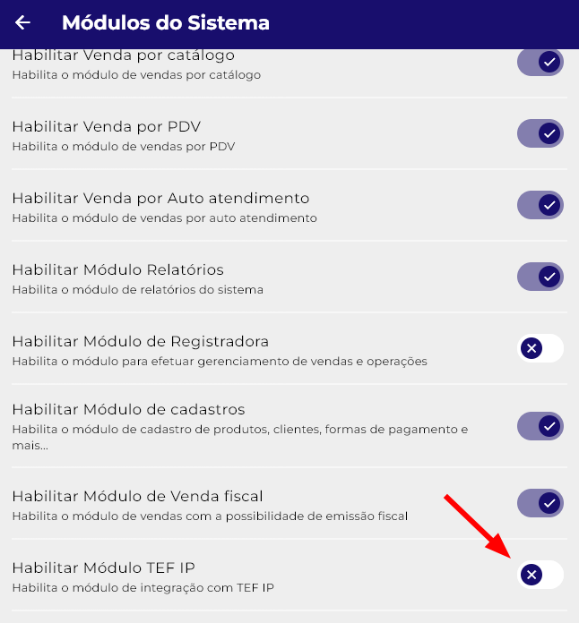
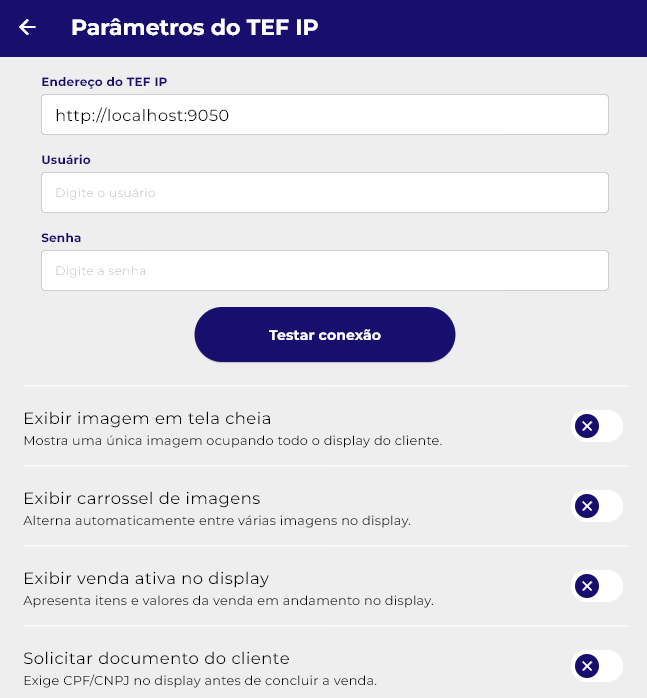
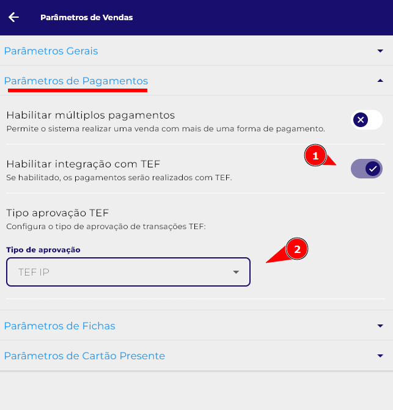
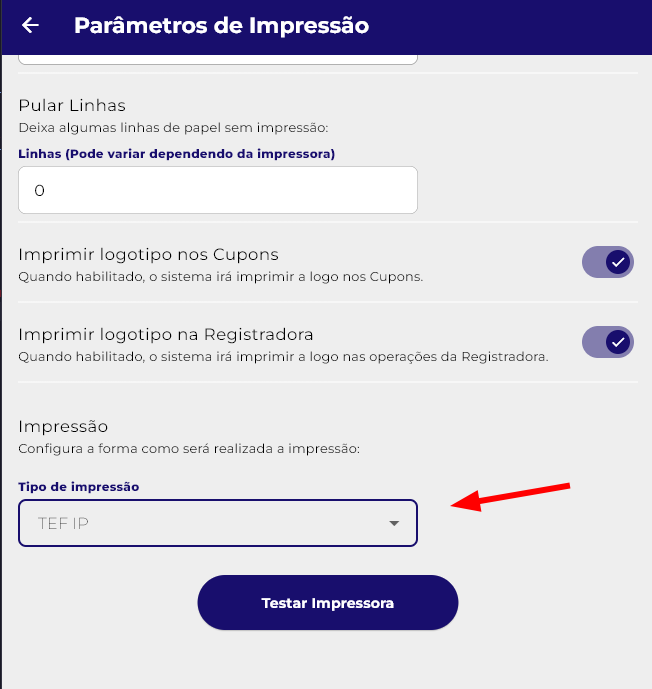

# Integração com Xpos

## Configurações necessárias no Xpos

1. **Habilitar módulo TEF IP**: Nas configurações do Xpos, acesse a aba “Módulos” e habilite o parâmetro “Módulo TEF IP”.
  { style="width: 420px; display: block; margin: 0 auto;"}

2. **Endereço IP**: Acesse a aba TEF IP e configure o IP do terminal TEF IP.
   { style="width: 420px; display: block; margin: 0 auto;"}

3. **Tipo aprovação TEF**: Acesse a aba “Parâmetros de Vendas” e na seção “Parâmetros de pagamentos” habilite o parâmetro “Integração com TEF” e em seguida altere o tipo de aprovação para TEF IP.
   { style="width: 420px; display: block; margin: 0 auto;"}

### Configuração Adicional (impressão)
- **Impressão**: Com esse parâmetro de impressão você consegue escolher se a impressão será realizada diretamente na maquininha (TEF IP) ou pelo próprio dispositivo (POS), como por exemplo um totem de autoatendimento que possui uma impressora própria.
   { style="width: 420px; display: block; margin: 0 auto;"}
