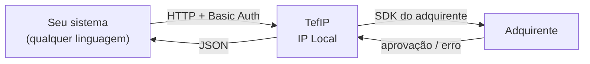
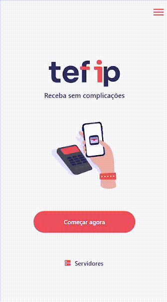

# TefIP

Aceite pagamentos com qualquer adquirente! Usando uma única API HTTP local.
Instale no terminal e comece a processar.

---

## O que você pode fazer

- **Pagamentos** — Crédito, débito, PIX, dinheiro, voucher, cartão-presente; parcelamento pelo lojista ou pela emissora.
- **Vendas** — Monte um carrinho com itens e adicione múltiplas formas de pagamento; finalize com uma chamada.
- **Estornos** — Consulte e reverta transações por `referenceId`.
- **Display** — Exiba textos, imagens, carrosséis ou QR codes na tela do terminal em tempo real.
- **Perguntas** — Colete dados do cliente direto no terminal: CPF/CNPJ, texto livre, lista de opções, e-mail, CEP e mais.
- **Impressão** — Imprima imagens, comprovantes personalizados ou cupons fiscais (XML/DANFE).
- **Status** — Monitore saúde, tempo de atividade e reinicie o app remotamente.

---

## Como funciona



Seu sistema faz chamadas HTTP para o TefIP. O TefIP se comunica com o hardware do adquirente
e retorna o resultado em JSON — sem nenhuma SDK proprietária no seu lado.

!!! tip "Sem maquininha? Use o emulador!"
    O TefIP inclui um **modo emulador** que simula o hardware do adquirente localmente.
    Você pode desenvolver e testar toda a integração sem nenhum terminal físico.
    [Clique aqui para saber como usar o emulador](getting-started.md#emulador)

Veja abaixo um pagamento sendo processado no emulador:



---

## Integração rápida

Exemplo de ponta a ponta: processar um PIX de R$ 50,00.

=== "cURL"

    ```bash
    curl -u admin:1234 \
         -H "Content-Type: application/json" \
         -X POST http://localhost:9050/transaction \
         -d '{"tPag":"17","amount":50.00,"referenceId":"pedido-001"}'
    ```

=== "Dart"

    ```dart
    import 'package:dart_tefip/dart_tefip.dart';

    // pub.dev/packages/dart_tefip
    TefIP.baseUrl = 'http://localhost:9050';
    TefIP.username = 'admin';
    TefIP.password = '1234';

    final result = await TefIP.instance.transaction.post(
      transactionRequest: TransactionRequestModel(
        type: TefIPTransactionType.pix,
        amount: 50.00,
        referenceId: 'pedido-001',
      ),
    );
    ```

=== "JavaScript"

    ```js
    // TODO: pacote JavaScript ainda não criado — usando fetch diretamente
    const res = await fetch('http://localhost:9050/transaction', {
      method: 'POST',
      headers: {
        'Authorization': 'Basic ' + btoa('admin:1234'),
        'Content-Type': 'application/json',
      },
      body: JSON.stringify({ tPag: '17', amount: 50.00, referenceId: 'pedido-001' }),
    });
    const data = await res.json();
    ```

=== "PHP"

    ```php
    <?php
    // TODO: pacote PHP ainda não criado — usando curl diretamente
    $ch = curl_init('http://localhost:9050/transaction');
    curl_setopt($ch, CURLOPT_USERPWD, 'admin:1234');
    curl_setopt($ch, CURLOPT_HTTPHEADER, ['Content-Type: application/json']);
    curl_setopt($ch, CURLOPT_POST, true);
    curl_setopt($ch, CURLOPT_POSTFIELDS, json_encode([
        'tPag' => '17',
        'amount' => 50.00,
        'referenceId' => 'pedido-001',
    ]));
    curl_setopt($ch, CURLOPT_RETURNTRANSFER, true);
    $response = json_decode(curl_exec($ch), true);
    curl_close($ch);
    ```

=== "Ruby"

    ```ruby
    # TODO: pacote Ruby ainda não criado — usando Net::HTTP diretamente
    require 'net/http'
    require 'json'

    uri = URI('http://localhost:9050/transaction')
    req = Net::HTTP::Post.new(uri, 'Content-Type' => 'application/json')
    req.basic_auth('admin', '1234')
    req.body = { 'tPag' => '17', amount: 50.00, referenceId: 'pedido-001' }.to_json
    res = Net::HTTP.start(uri.hostname, uri.port) { |h| h.request(req) }
    data = JSON.parse(res.body)
    ```

---

## Adquirentes suportados

Cada build do TefIP é compilado para um adquirente específico.

<div class="grid cards">
  <ul>
    <li><p><a href="https://www.stone.com.br" target="_blank"><strong>Stone</strong></a></p></li>
    <li><p><a href="https://www.getnet.com.br" target="_blank"><strong>Getnet</strong></a></p></li>
    <li><p><a href="https://www.userede.com.br" target="_blank"><strong>Rede</strong></a></p></li>
    <li><p><a href="https://pagseguro.uol.com.br" target="_blank"><strong>PagSeguro</strong></a></p></li>
  </ul>
</div>

---

## SDKs disponíveis

| Linguagem | Pacote | Status |
|-----------|--------|--------|
| Dart / Flutter | [`dart_tefip`](https://pub.dev/packages/dart_tefip) | Disponível |
| JavaScript | — | Em breve |
| PHP | — | Em breve |
| Ruby | — | Em breve |

Qualquer cliente HTTP funciona diretamente — os SDKs são conveniência, não requisito.

---

## Próximos Passos

- [Primeiros Passos](getting-started.md) — Instale o TefIP e faça sua primeira requisição.
- [Referência da API: Transações](api/transaction.md) — Documentação completa dos endpoints de pagamento.
- [Swagger Docs](http://djsystem.com.br) — Swagger UI interativo no próprio terminal
