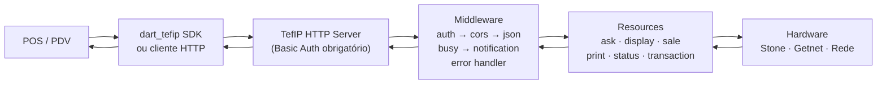

# TefIP

**TefIP** é um app Flutter que roda um servidor HTTP embutido (baseado em [shelf](https://pub.dev/packages/shelf)). Sistemas POS/PDV enviam requisições HTTP para ele; o TefIP roteia essas requisições pelo hardware de pagamento (Stone, Getnet, Rede) e retorna o resultado.

> **Ação necessária:** adicione o arquivo `docs/assets/diagrama-arquitetura.png` aqui.

---

## Fluxo do App

---

## Grupos de API

| Grupo | Descrição | Endpoints |
|-------|-----------|-----------|
| [ask](api/ask.md) | Exibe perguntas e formulários no terminal | POST /ask, POST /ask/form, POST /ask/cancel |
| [display](api/display.md) | Controla o display do terminal | POST /display/image, /text, /carousel, /clear |
| [sale](api/sale.md) | Gerencia vendas (itens, pagamentos, finalização) | POST /sale, /sale/item, /sale/payment, /sale/finalize, /sale/cancel + PATCH e DELETE |
| [print](api/print.md) | Impressão de comprovantes | POST /print/image, /print/text, /print/xml |
| [status](api/status.md) | Estado e informações do terminal | GET /status, GET /info, POST /restart |
| [transaction](api/transaction.md) | Consulta e estorno de transações | POST /transaction, GET /transaction/{id}, POST /transaction/{id}/reversal |
| [swagger](api/swagger.md) | Documentação OpenAPI interativa | GET /docs, GET /openapi.bundle.yaml |

---

## Próximos Passos

Veja [Primeiros Passos](getting-started.md) para instalar o TefIP e fazer sua primeira requisição.
